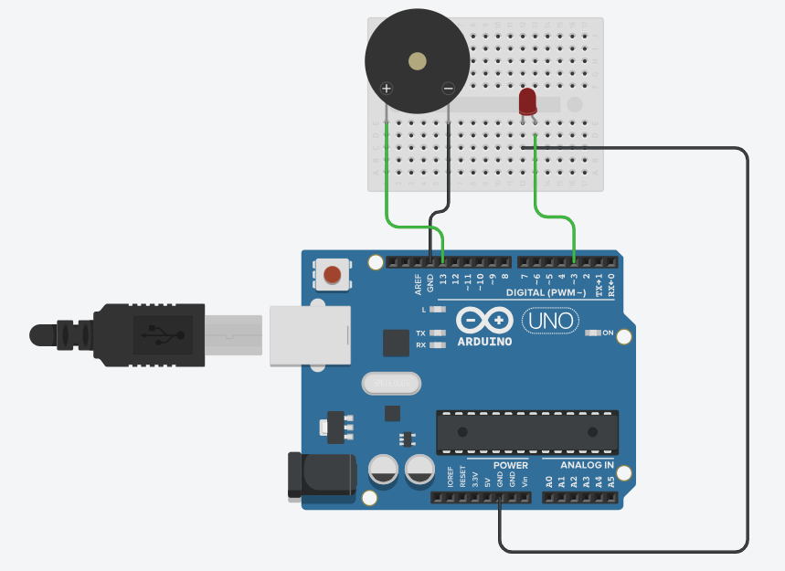

# Terakhir Kali - Wijaya 80 on Arduino UNO

This project brings the song **"Terakhir Kali"** by **Wijaya 80** to life using an **Arduino UNO** and a **Passive Buzzer**. The melody is programmed using frequency-based note definitions, allowing the Arduino to generate the tune accurately.

## 🛠️ Hardware Requirements
- Arduino UNO
- Jumper Wires
- Breadboard
- LED
- Passive Buzzer

## 📝 Wiring

## 🚀 Getting Started
### 1️⃣ Install the Arduino IDE
Make sure you have the **Arduino IDE** installed on your computer. You can download it from [Arduino's official website](https://www.arduino.cc/en/software).

### 2️⃣ Connect the Components
- **Passive Buzzer:** Connect the **positive pin** (+) of the buzzer to **pin 13** on the Arduino.
- **Buzzer Ground:** Connect the **negative pin** (-) of the buzzer to **GND** on the Arduino.
- **LED:** Connect the **short leg** of the LED to **pin 3** on the Arduino.
- **LED Ground:** Connect the **long leg** of the LED to **GND** on the Arduino.

### 3️⃣ Upload the Code
1. Select the correct **board (Arduino UNO)** and **port**.
2. Click **Upload** and listen to the song play!

## 📌 Future Improvements
- Add support for **multiple songs**.
- Create a **user interface** for song selection.
- Improve the **sound quality** with better timing adjustments.

## 📝 Credits
- **Song:** "Terakhir Kali" - Wijaya 80
- **Project by:** Muhammad Adeva

---

Enjoy making music with your Arduino! 🎼

